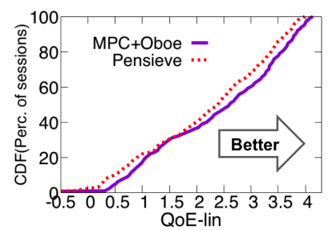
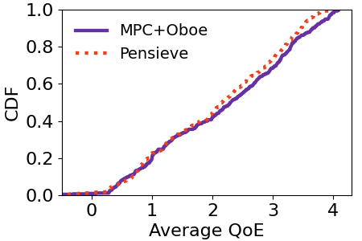

# Oboe-Reproduce

This is the *unofficial implementation* of the paper "Oboe: Auto-tuning video ABR algorithms to network conditions, Zahaib Akhtar, Yun Seong Nam, Ramesh Govindan, Sanjay Rao, Jessica Chen, Ethan Katz-Bassett, Bruno Ribeiro, Jibin Zhan, Hui Zhang, ACM SIGCOMM, 2018".
The code is reconstructed based on the official implementation provided by the authors (Yun and Zahaib).

Here please note that in the original paper, predicted throughput for each system is reduced by a factor of 1/1+d, where d is the learnable value. While in this repo., the throughput is directly discounted by d.

# Setup

We include most modules here. To install MPC module do the following steps

```
pip install pybind11
cd cc
sh build.sh
```

# Config Map

The MPC's config map has already been trained in *src/configmap_mpc.py*, while training a new one is also welcomed.

```
cd configmap
python train_configmap.py
```

# Results
To run MPC+Oboe just do the following steps

```
cd src/
python oboe_mpc.py
```

Also, plot the figure using

```
pip install matplotlib
python plot.py
```

Results are reported in *details/cdf.png'*. Moreover, we plot the comparison of the performance of this repo. and the original paper here. 

Here left: the original paper, right: our implementation.

<p align="center">
    
</p>